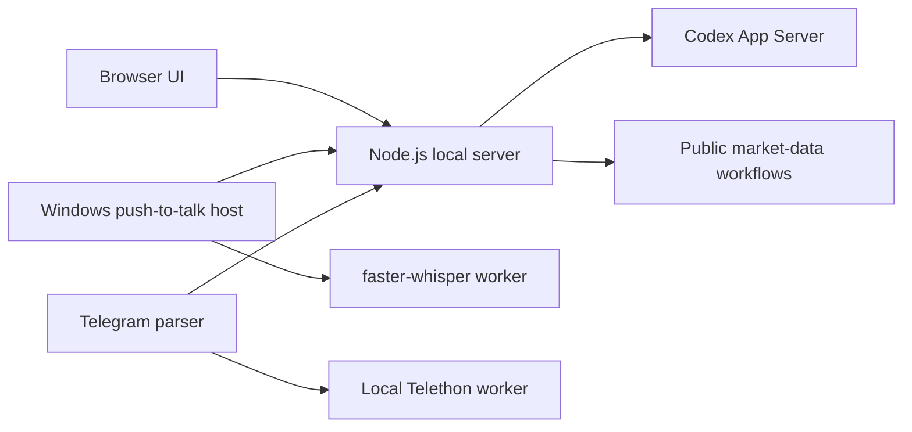

# JARVIS Local Codex

JARVIS Local Codex is a Windows-focused local assistant that connects a browser interface to Codex App Server, optional speech transcription, a local Telegram parser, and public-market research workflows.

It keeps runtime state on the local machine and does not require an `OPENAI_API_KEY`; Codex features require an existing local Codex session with App Server available.

## Capabilities

- Streams conversations from Codex App Server, manages threads, and presents required action confirmations.
- Provides push-to-talk input through a Windows host and a local `faster-whisper` worker.
- Runs a Telethon-based Telegram parser locally; it does not automatically reply to Telegram users.
- Scans public Binance USD-M Futures data and creates local preview material. Publishing is a separate credential-gated mode.

## Architecture



The Node server serves the local UI and coordinates integrations. Temporary voice audio is removed after transcription. Parser preferences, session material, and runtime data remain local; the Windows host and speech workflow are Windows-specific.

## Stack

- Node.js 22+ and ES modules
- Codex CLI / Codex App Server
- Windows Forms / .NET Framework C# host
- Python 3.12, `faster-whisper`, and Telethon
- Local browser UI and Node test runner

## Repository layout

```text
public/          Browser interface
src/             Node server, App Server client, voice, parser, and market modules
windows-host/    Windows push-to-talk host
speech/          Local faster-whisper worker
parser_worker/   Local Telethon parser worker
scripts/         Setup and Windows-host build scripts
test/            Node.js test suite
```

## Requirements

- Windows
- Node.js 22 or later
- Codex CLI with App Server available
- Python 3.12 (`py -3.12`) for speech and parser features
- The Windows .NET Framework C# compiler for the host build

The speech model is downloaded locally on first use and is intentionally not committed.

## Run locally

1. Clone the repository and open its root directory.
2. Confirm `node`, `codex`, and `py -3.12` are available in `PATH`.
3. Run `START_JARVIS.bat`.

The interface opens at `http://127.0.0.1:3210`. Use `STOP_JARVIS.bat` to stop the local processes.

## Configuration and privacy

`.env.example` documents optional variables, but the application does not load `.env` automatically. Supply configuration through the process or user environment.

`JARVIS_CRYPTO_MODE` defaults to `DRY_RUN`; `AUTO` is a separately configured publishing mode. The project does not use trading or withdrawal keys. Telegram credentials, session files, parser databases, audio, transcripts, logs, model caches, previews, and runtime state are local-only and excluded by `.gitignore`.

Never add credentials to source control or pass them on a command line. Use a secondary Telegram account for the parser workflow as intended by the application.

## Verification

```powershell
npm.cmd test
npm.cmd run check
```

Parser tests require the project-local Python environment prepared by the setup flow:

```powershell
npm.cmd run test:parser
```

The complete Node suite also contains local speech benchmark and worker-integration tests. Those tests require intentionally untracked voice fixtures or the Windows project-local Python environment; CI runs the self-contained Node checks and does not fabricate those inputs.

## Limitations

- The Windows host and voice flow require a compatible local Windows setup.
- Codex features require a working local Codex session and App Server.
- Telegram and optional publishing workflows require user-provided local configuration.
- No source license has been selected or added automatically.
